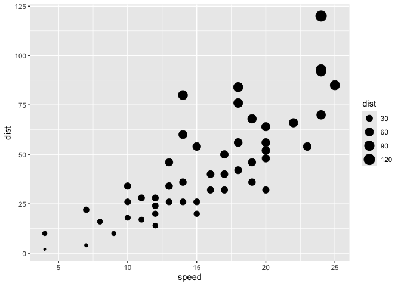
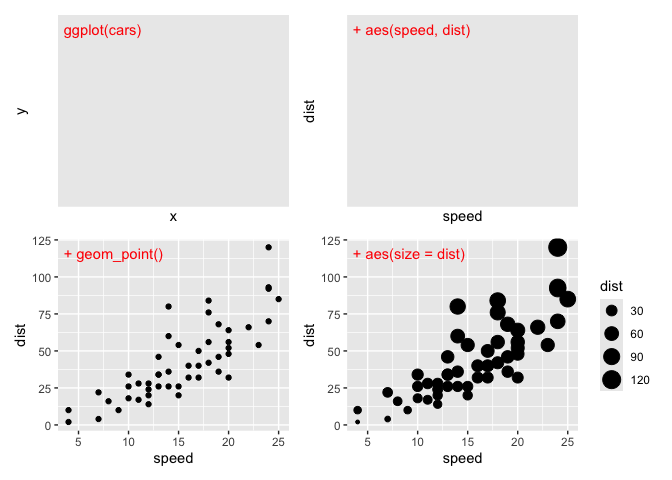

<!-- README.md is generated from README.Rmd. Please edit that file -->

# ggstoryboard

``` r
library(ggplot2)
```

<!-- badges: start -->

<!-- badges: end -->

The goal of ggstoryboard is to show ggplot builds decision by decision.

``` r
devtools::create(path = "."
```

An example plot, chunk is called ‘carsplot’

``` r
ggplot(cars) + 
  aes(speed, dist) + 
  geom_point() + 
  aes(size = dist)
```

<!-- -->

``` r
code_to_storyboard <- function(code = NULL){

unconnected_code <- code |> 
  stringr::str_trim() |> 
  stringr::str_remove("\\+$")


partialcode <- c()

for(i in 1:length(code)){
  
  partialcode[i] <- paste(unconnected_code[1:i], collapse = " + ")
  
}


p <- list()  # Partial code sequence

for(i in 1:length(partialcode)){
  
  p[[i]] <- eval(parse(text = partialcode[i]))
  
 label <- ifelse(i > 1, paste("+", unconnected_code[i]), unconnected_code[i])
 
  p[[i]] <- p[[i]] + ggplot2::annotate(geom = "text",
                              x = I(.025),
                              y = I(.95), 
                              hjust = 0,
                              vjust = 1,
                              label = label,
                              color = "red"
                              )
  # 
}

patchwork::wrap_plots(p, ncol = 2)

}
```

``` r
knitrExtra::chunk_code_get("carsplot") |> 
  code_to_storyboard()
#> It seems you are currently knitting a Rmd/Qmd file. The parsing of the file will be done in a new R session.
```

<!-- -->

``` r
chunk_to_storyboard <- function(chunk_name){
  
  knitrExtra::chunk_code_get(chunk_name) |>
    code_to_storyboard()
  
}
```

``` r
chunk_to_storyboard(chunk_name = "carsplot")
#> It seems you are currently knitting a Rmd/Qmd file. The parsing of the file will be done in a new R session.
```

<!-- -->

``` r
knitrExtra:::chunk_to_r("chunk_to_storyboard")
#> It seems you are currently knitting a Rmd/Qmd file. The parsing of the file will be done in a new R session.
knitrExtra:::chunk_to_r("code_to_storyboard")
#> It seems you are currently knitting a Rmd/Qmd file. The parsing of the file will be done in a new R session.
```

``` r
usethis::use_package("stringr")
#> ✔ Setting active project to '/Users/evangelinereynolds/Google
#> Drive/r_packages/ggstoryboard'
usethis::use_package("ggplot2")
usethis::use_package("patchwork")
```

``` r
usethis::use_dev_package(package = "knitrExtra", remote = "EvaMaeRey/knitrExtra")
```

``` r
devtools::check(".")
```
